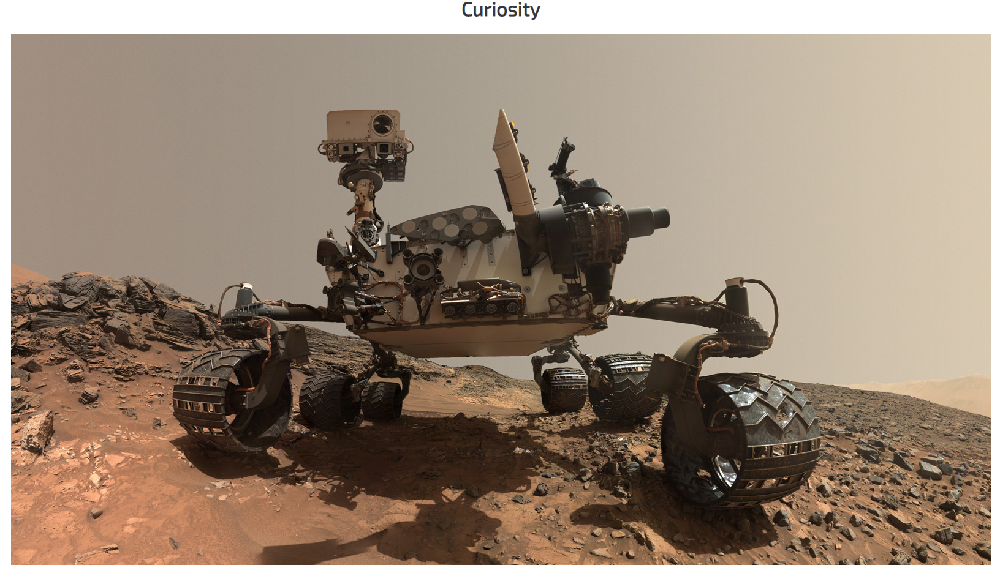
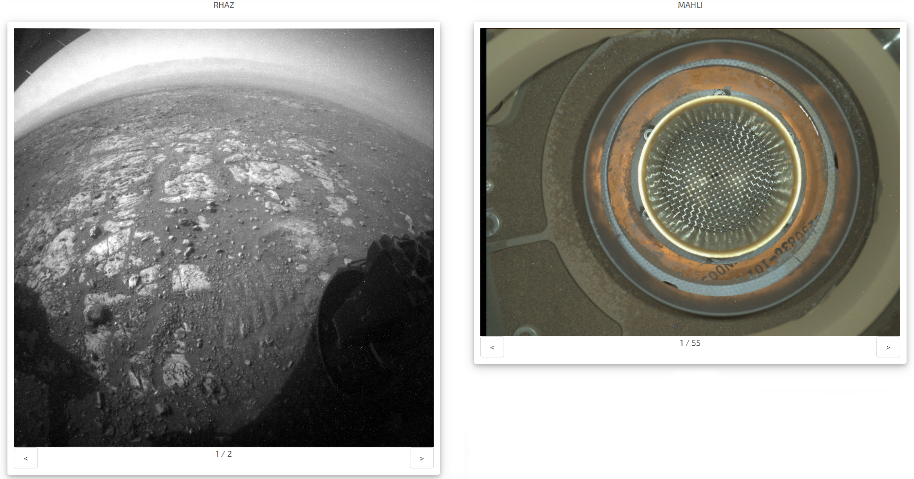
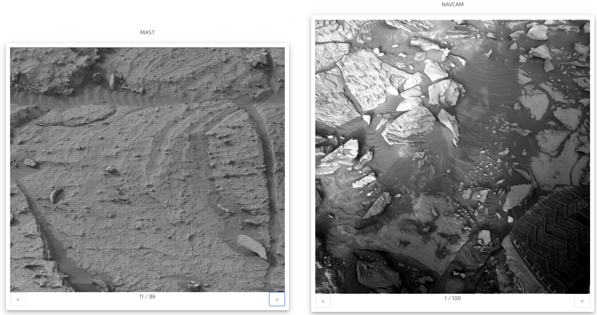

# GA Project - Mars Through Curiosity

### Links

https://sirdan-mars-through-curiosity.netlify.app/ <-- Try it here!

https://github.com/sirdantheawesome/Mars-Through-Curiosity <-- Github

## Approach

This was a pairs project in which we needed to create a React website which used an external API. Me and my programming partner both had a big interest in NASA and quickly found that they have a really good API system. We decided that we would use the rover API to create our website. Our main goals for the project were:

- Display all main cameras from the Mars Curiosity Rover
- Display different images based on the Mars Sol date
- Be able to scroll through multiple images on a single day for the same camera
- Be able to change the current day being shown
- Properly error handle when either the Sol day was missing or images were missing from that day

Design wise we were aiming for a brief intro page explaining the project with the main page being accessible using a button. The main page design we wanted to be picture of the rover with camera images being shown below (with tabs to flick through each camera) and a bottom element for selecting different Sol days.

## Task management

Since for this project we had not fully learnt git branches we ended up using LiveServer to do pair programming with both of us discussing and working on the project at the same time for the most part and making sure all elements looked right to both of us. There were benefits of this approach as we felt we got a much more complete understanding of the whole program which was helpful for learning. We did find however that after we had learnt git branching and working on different aspects at the same time that it is a much more efficient approach and preferable in most cases.

# The code

## Main layout

We started setting up the main page with a rough layout and some placeholder images so that we could start setting up how we wanted the main page to function.

```html
  return (
    <>
      <h1 className="title has-text-centered">Curiosity</h1>
      
      <div className="columns">
        <div className="column">
          <div>
            <h4 className='has-text-centered'>FHAZ</h4>
            <CameraCard
              imgArray={allPhotos ? getImages('FHAZ') : []}
            />
          </div>
          <div>
            <h4 className='has-text-centered'>RHAZ</h4>
            <CameraCard
              imgArray={allPhotos ? getImages('RHAZ') : []}
            />
          </div>
          <div>
            <h4 className='has-text-centered'>MAST</h4>
            <CameraCard
              imgArray={allPhotos ? getImages('MAST') : []}
            />
          </div >
        </div>
        <div className="column">
          <div>
            <h4 className='has-text-centered'>CHEMCAM</h4>
            <CameraCard
              imgArray={allPhotos ? getImages('CHEMCAM') : []}
            />
          </div>
          <div>
            <h4 className='has-text-centered'>MAHLI</h4>
            <CameraCard
              imgArray={allPhotos ? getImages('MAHLI') : []}
            />
          </div >
          <div>
            <h4 className='has-text-centered'>NAVCAM</h4>
            <CameraCard
              imgArray={allPhotos ? getImages('NAVCAM') : []}
            />
          </div >
        </div >
      </div >
    </>
  )
}
```

## Camera Cards

We then set up a Camera Card element which we could replace our hard coded placeholders with. These still used placeholder values for now.

```html
return (
<div className="card is-flex-direction-column column">
  <div className="is-flex is-justify-content-center">
     0 ?
    imgArray[index].img_src : 'https://wallpapercave.com/wp/wp7002139.gif' } />
  </div>
  <div className="columns is-gapless">
    <button id="left" className="button is-pulled-left" onClick="{handleClick}">
      {'<'}
    </button>
    <p className="column has-text-centered">
      {imgArray.length > 0 ? `${index + 1} / ${imgArray.length}` : 'No Signal'}
    </p>
    <button
      id="right"
      className="button is-pulled-right"
      onClick="{handleClick}"
    >
      {'>'}
    </button>
  </div>
</div>
) }
```

## NASA API

After setting up the main page and the Camera Card we decided it was time to hook up the NASA API so that we could start properly loading in images for our website. To fetch data from the API we used Axios. We also had to sign up and get our unique API key which we could use for the site. This was stored in our .env file to keep it a secret.

```js
import axios from "axios";

const photoBaseUrl =
  "https://api.nasa.gov/mars-photos/api/v1/rovers/curiosity/photos?sol=";
const manifestBaseUrl =
  "https://api.nasa.gov/mars-photos/api/v1/manifests/Curiosity/?";

const API_KEY = `api_key=${process.env.REACT_APP_API_KEY}`;

export function getAllPhotos(day) {
  return axios.get(photoBaseUrl + day + "&" + API_KEY);
}

export function getManifest() {
  return axios.get(manifestBaseUrl + API_KEY);
}
```

## Footer

The footer had to be vaguely connected to everything else since we were pulling information about the Sol day in it and passing it to the API. We also implemented error handling into the footer to make sure you couldn't land on a day which didn't exist yet.

```html
 return (
    <footer className='footer'>
      <div className='content has-text-centered'>
        <input
          type="number"
          className='input is-one-third'
          placeholder='Sol Days: e.g. 1000'
          onKeyDown={handleChange}>
        </input>
        <button
          className='button'
          onClick={handleRandom}
        >
          Random Sol!
        </button>
      </div>
      <p className='has-text-centered'>{manifest ? `Latest Sol Date: ${manifest.photo_manifest.max_sol}` : '...loading'}</p>
    </footer >
  )
}
```

## Visuals

Overall we wanted the images to display as close to full resolution as possible since the cameras on curiosity are truly spectacular. We had a nice header image of the rover followed by the 6 main cameras.






## Challenges

The key challenges for this project were mostly to do with error handling. After the API was set up we kept finding new bugs to do with empty data slots being sent back since Curiosity didn't send back data every day. To solve this problem we had to use a number of checks and placeholders for when data came back empty. This was a good learning experience in thoroughly testing a site and looking for common slip ups.

## Wins

We managed to squeeze in a few stretch goals we had like having a random day button and filtering nicely through all the days up and down. In general the entire project was special to me since I am very interested in space and the industry and Curiosity is a very very cool rover. Using more of the NASA API would definitely be something I would be interested in exploring further in the future.
